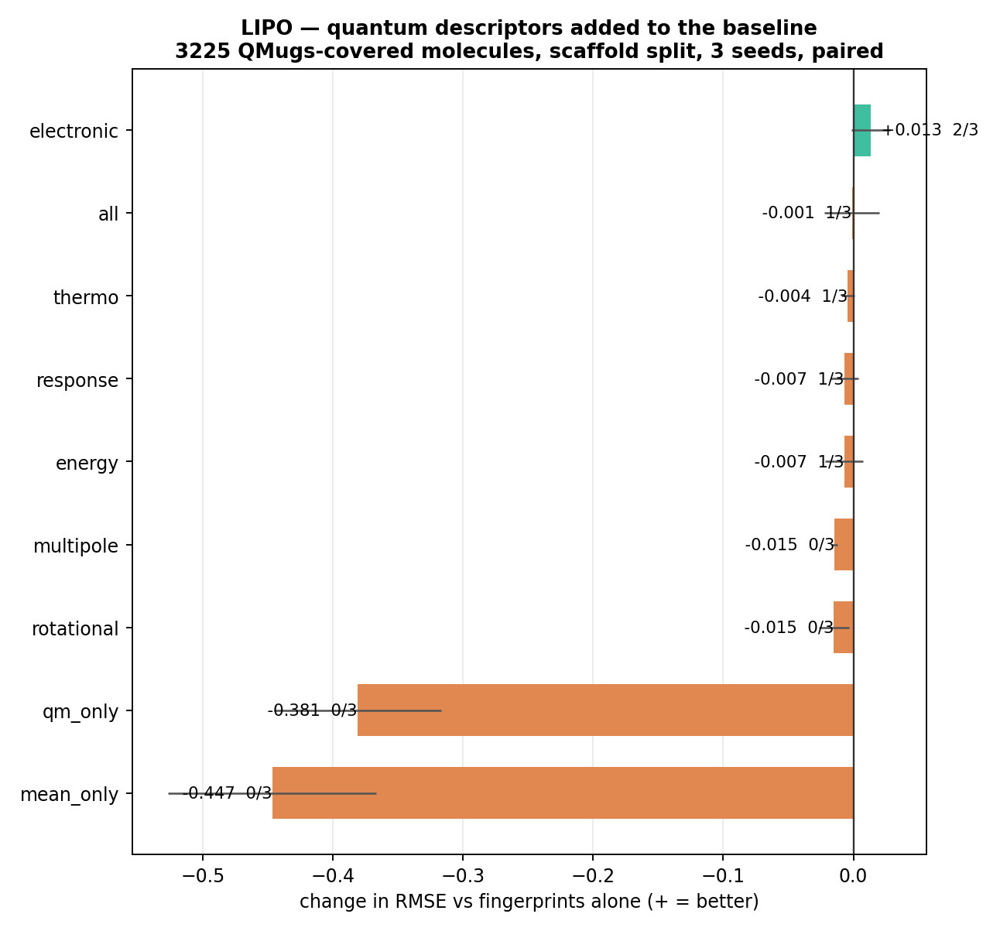
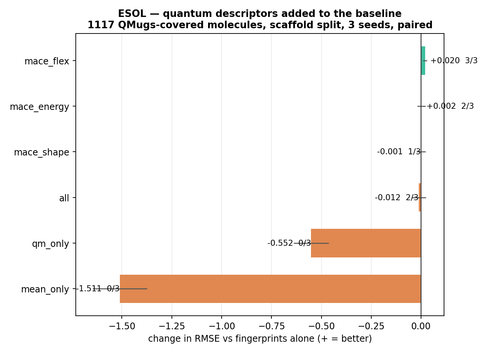

# When does a graph neural network actually beat molecular fingerprints?

**Less often than the question implies — and for reasons that have little to do with either
model. Across two architectures and eleven descriptor sets, thirteen ways of representing a
molecule, the largest test-error improvement any of them buys is 0.052 RMSE. Changing the ESOL
test set from a random split to a scaffold split costs 0.171. The way a benchmark is assembled
and scored moves the number more than the way the molecule is represented, and on one dataset it
moves it 57× more.**

The corollary is the useful part: a published benchmark score is as much a property of how the
dataset was built as of the model being scored. This repo measures each lever separately, on a
common scale, with every comparison paired within seed.

Four MoleculeNet datasets (ESOL, Lipophilicity, BACE, BBBP; n = 1.1k–4.2k). Two models: a GINE
message-passing network and a Morgan-fingerprint LightGBM baseline. Random and Bemis–Murcko
scaffold splits. Learning curves from 100 molecules to full size. Two independent sources of
physics-based descriptors. Three seeds throughout.


---

## The levers, on one scale

Largest effect on test error observed for each lever, across all four datasets. Positive means
the change makes the model better; the split row is inverted (positive = scaffold is harder).

| lever | section | largest effect | where | reliable? |
| --- | --- | --- | --- | --- |
| **How the test set is split** | §1 | **0.171 RMSE** (+21.0%) | ESOL, random → scaffold | 6/6 pairings |
| How much training data (100 → 500) | §2 | 0.197 RMSE | lipophilicity, baseline's lead at n=100 | 3/3 seeds |
| Architecture (fingerprint → GNN) | §3a | 0.052 RMSE (+7.4%) | lipophilicity | 3/3 seeds |
| + 53 gas-phase quantum descriptors | §3b | 0.013 RMSE | lipophilicity, frontier orbitals | 2/3 seeds — s.d. exceeds effect |
| + 9 conformer descriptors from an MLIP | §3c | 0.020 RMSE (+2.4%) | ESOL, flexibility | 3/3 seeds |

Read down the table: every row below the first is a change to *how the molecule is
represented*, and none of them is worth as much as the first row. That ordering is the result.

Section 4 explains why the representation rows are as small as they are — the advantage is real
but confined to one similarity bin — and section 5 shows what the errors that remain are made of.

---

## 1. How the test set is chosen


Scaffold minus random, paired within (model, seed); and GNN minus baseline on the scaffold
split, paired within seed.

| dataset | metric | split effect | pairs scaffold harder | model effect | seeds GNN wins |
| --- | --- | --- | --- | --- | --- |
| ESOL | RMSE | **+0.171** (+21.0%) | **6/6** | −0.003 (−0.3%) | 1/3 |
| Lipophilicity | RMSE | +0.075 (+10.6%) | 5/6 | **+0.052** (+7.4%) | **3/3** |
| BACE | ROC-AUC | +0.019 (+2.1%) | 2/6 | −0.021 (−2.4%) | 0/3 |
| BBBP | ROC-AUC | −0.024 (−2.6%) | 1/6 | +0.019 (+2.1%) | **3/3** |

On ESOL the split effect is 57× the model effect and unanimous across pairings — the result that
motivated this repo.

**But it does not generalise, and that is the second finding.** On both classification datasets
the split effect is within seed noise, and on BBBP the scaffold split is *easier* than random in
5 of 6 pairings. "Always use a scaffold split, it's harder" is true for the two regression sets
here and false for the two classification sets.

One plausible reason, offered as interpretation rather than result: ROC-AUC is a ranking metric
and is insensitive to a uniform shift in predicted scores, whereas RMSE is not, so covariate
shift between train and test costs a regression model more than a classifier. BBBP additionally
has well-documented label noise and strong class imbalance, either of which can swamp a small
split effect. Neither interpretation is tested here.

---

## 2. How much training data

| dataset | crossover | advantage at full size | seeds |
| --- | --- | --- | --- |
| ESOL | none (best 1/3, at n=250) | +0.012 | 1/3 |
| Lipophilicity | **between 250 and 500** | +0.056 | 2/3 |
| BACE | none (best 1/3, at n=100) | −0.074 | 1/3 |
| BBBP | **between 250 and 500** | +0.005 | 2/3 |

A seed-consistent crossover exists on 2 of 4 datasets, both between 250 and 500 training
molecules. Below ~250 molecules the baseline wins everywhere, on every dataset, by a wide margin
(0.16–0.20 RMSE on the regression sets). Paired advantage by training size is in
`results/paired_curve_all.csv`.

Two qualifications that matter more than the headline:

**The advantage does not widen with more data.** On lipophilicity it peaks at n=500 (+0.100) and
is smaller at full size (+0.056). The intuition that a GNN pulls further ahead as the dataset
grows is not what the curves show.

**Data scale alone does not predict the crossover.** ESOL and BACE never cross at any size
tested. Whether one occurs is decided by section 4, not by n.

---

## 3. How the molecule is represented

Three representation changes, measured the same way: paired within seed, against the same
fingerprint baseline.

### 3a. Architecture — learned graph vs. fixed fingerprint

Covered in the §1 table: +0.052 RMSE on lipophilicity and +0.019 ROC-AUC on BBBP, against
−0.003 and −0.021 on the other two. Two wins, two losses, and the largest of them is a third
the size of the ESOL split effect.

### 3b. Gas-phase quantum descriptors from QMugs (Lipophilicity)

Precomputed GFN2-xTB and DFT (ωB97X-D/def2-SVP) properties from
[QMugs](https://doi.org/10.3929/ethz-b-000482129), matched by InChIKey skeleton. 3,225 of 4,200
lipophilicity molecules matched (76.8%); ESOL matched only 24.2%, BBBP 35.7%.

Coverage is not missing at random — QMugs is ChEMBL-derived and omits the solvents and
agrochemicals — so every model below is fitted and scored on the same 3,225 covered molecules,
with the scaffold split recomputed on that subset. QMugs' classical columns (MW, ring count,
H-bond counts) are excluded, since the fingerprint baseline already carries RDKit equivalents.



Paired change in RMSE against fingerprints alone (0.681 ± 0.086); positive is better.

| features | n cols | ΔRMSE | s.d. | seeds improved |
| --- | --- | --- | --- | --- |
| electronic (HOMO, LUMO, gap, Fermi) | 7 | +0.013 | 0.015 | 2/3 |
| all quantum | 53 | −0.001 | 0.021 | 1/3 |
| thermo (enthalpy, entropy, heat capacity) | 14 | −0.004 | 0.005 | 1/3 |
| response (polarizability, dispersion) | 2 | −0.007 | 0.011 | 1/3 |
| energy (extensive totals) | 10 | −0.007 | 0.015 | 1/3 |
| multipole (dipole, quadrupole) | 14 | **−0.015** | **0.003** | **0/3** |
| rotational (moments of inertia) | 6 | **−0.015** | 0.012 | **0/3** |
| quantum only, no fingerprints | 53 | **−0.381** | 0.064 | **0/3** |
| constant prediction (training mean) | 0 | **−0.447** | 0.080 | **0/3** |

**Nothing reliably improves on fingerprints.** The largest positive effect, the frontier orbital
block at +0.013, has a standard deviation larger than the effect itself.

**Two families reliably degrade performance.** Multipole and rotational descriptors lose on 3/3
seeds, and the multipole standard deviation of 0.003 makes it the tightest number in the table.
With `colsample_bytree=0.5`, fourteen dense weakly-informative columns compete with informative
bits at every split of a 2048-bit sparse fingerprint. Feature dilution, measured rather than
asserted.

**The quantum block is weak, not merely redundant.** Fitted alone it scores 1.062 against 0.681
for fingerprints alone, on every seed. Had it been redundant it would have scored comparably and
simply added nothing; instead it carries far less information about this endpoint than
substructure counts do. Predicting the training mean gives 1.127, so the 53 quantum descriptors
close only **14% of the gap** between that floor and the fingerprint model (0.065 of 0.446
RMSE), and inconsistently — 16%, 23% and 3% across the three seeds.

*What this does and does not show.* These descriptors are gas-phase, neutral-form and
single-conformer. The labels are experimental logD at pH 7.4, governed by ionization state and
by solvation free energy — neither of which appears anywhere in the 53 columns. The finding is
that **gas-phase electronic structure adds nothing over fingerprints for a solution-phase,
pH-dependent property.** It is not evidence that quantum chemistry is uninformative about
lipophilicity: the quantity that would matter, ΔG_solv, is absent from QMugs and would have to
be computed with an implicit-solvent method such as GFN2-xTB/ALPB.

Seed 1 scored 0.779 against 0.624 and 0.639 for the other two — the same scaffold-split seed
instability seen throughout this repo, reappearing in a different experiment.

### 3c. Conformer descriptors from MACE-OFF23 (ESOL)

MACE-OFF23 is a machine-learned interatomic potential trained on SPICE at
ωB97M-D3(BJ)/def2-TZVPPD. It returns energies and forces rather than wavefunctions, so it
supplies no orbital energies or solvation terms — but it does supply relaxed geometry and the
relative energies of a conformer ensemble, at a few seconds per molecule. Three ETKDG conformers
per molecule, MMFF cleanup, LBFGS relaxation to 0.05 eV/Å in float64. All 1,117 ESOL molecules
completed.



Paired change against fingerprints alone (0.816 ± 0.148); positive is better.

| features | n cols | ΔRMSE | s.d. | seeds improved |
| --- | --- | --- | --- | --- |
| flexibility (conformer energy spread, s.d.) | 2 | **+0.020** | 0.011 | **3/3** |
| energy (relaxed energy per atom, strain) | 2 | +0.002 | 0.021 | 2/3 |
| shape (R_g, principal moments, asphericity) | 5 | −0.001 | 0.022 | 1/3 |
| all MACE descriptors | 9 | −0.012 | 0.036 | 2/3 |
| MACE only, no fingerprints | 9 | −0.552 | 0.088 | 0/3 |
| constant prediction (training mean) | 0 | −1.511 | 0.136 | 0/3 |

**Flexibility is the only descriptor family in either experiment to improve on fingerprints
across all seeds** — one of eleven tested. The effect is small: +0.020 RMSE on a baseline of
0.816, about 2.4%. With three seeds the paired t-statistic is roughly 3.0 on 2 degrees
of freedom, so the direction is consistent but the effect is not significant at conventional
thresholds. It is a signal worth following, not a settled result.

This is the term the General Solubility Equation predicts a 2D graph cannot supply. Aqueous
solubility depends on the crystal lattice, and lattice energy depends on molecular rigidity;
conformer energy spread is a computable proxy for that rigidity, and molecular topology is not.
Of the descriptors tested, the one that helped is the one predicted to help, on the endpoint
predicted to need it.

Two observations qualify it. Adding all nine descriptors together is *worse* than adding the two
flexibility columns alone — the same dilution effect measured in §3b. And the spread descriptor
is zero-inflated: a quarter of ESOL molecules are rigid enough to have a single minimum, so the
signal comes from the flexible half of the dataset only.

Fitted without fingerprints, the nine MACE descriptors reach 1.368 against 2.328 for a constant
prediction and 0.816 for fingerprints — closing 63% of the gap, against 14% for QMugs' 53
gas-phase columns. Most of that is molecular size: relaxed energy per atom tracks elemental
composition, and the moments of inertia track volume, both of which dominate solubility. The
incrementally useful part is flexibility alone.

---

## 4. Why the representation effect is small: it lives in one similarity bin

The three representation changes in §3 are small *on aggregate*. They are not small everywhere.

Mean absolute error binned by maximum Tanimoto similarity to any training molecule, scaffold
split. Positive `Δ` means the GNN is better.

| similarity bin | ESOL Δ (n) | Lipo Δ (n) | BACE Δ (n) | BBBP Δ (n) |
| --- | --- | --- | --- | --- |
| 0.0 – 0.3 | **+0.225** (30) | **+0.224** (36) | — (0) | **+0.155** (20) |
| 0.3 – 0.4 | −0.161 (25) | +0.092 (70) | — (0) | +0.212 (37) |
| 0.4 – 0.5 | −0.074 (29) | +0.040 (61) | +0.229 (4) | +0.153 (40) |
| 0.5 – 0.7 | −0.225 (18) | +0.069 (132) | +0.072 (54) | +0.277 (81) |
| 0.7 – 1.0 | −0.084 (11) | +0.035 (121) | +0.021 (94) | +0.292 (20) |


**Wherever a test set contains molecules below 0.3 similarity to anything in training, the GNN
predicts them better** — on ESOL, lipophilicity and BBBP alike, by +0.155 to +0.225 MAE each
time. A Morgan fingerprint is a similarity-matching representation: it performs well when the
test molecule resembles a training molecule and degrades sharply when it does not. On ESOL the
baseline's error is 2.5× higher in the least-similar bin than in the most similar (1.132 vs.
0.449); the GNN's is 1.7× (0.906 vs. 0.532).

Three consequences, and they close the argument.

**BACE's test set has no molecules below 0.4 similarity.** It is a single-target inhibitor
series, so the region where the GNN helps does not occur — and BACE is exactly the dataset where
the GNN loses at every training size in §2 and on aggregate in §1. *The model comparison was
decided by dataset construction before either model was trained.*

**A bin-level advantage need not become an aggregate one.** ESOL has the largest share of novel
test molecules of the four (49% below 0.4 similarity), and the GNN still wins only that one bin
— it is worse in the other four, which hold the remaining 51% of the test set. Lipophilicity is
the case where the GNN is better in every bin, and it is the dataset with the clearest aggregate
win.

**This is why the §3 effects are small.** An advantage confined to the 5–10% of test molecules
that are structurally novel is diluted to near-zero by aggregate scoring. The representation
rows in the summary table are not measuring "the GNN is barely better" — they are measuring a
large advantage on a small subset, averaged against the rest.

**BBBP is anomalous** and I cannot explain it: the baseline's error *rises* with similarity to
training (0.327 → 0.447), the opposite of the expected direction. Consistent with the label-noise
caveat in §1, and not otherwise accounted for here.

---

## 5. What the remaining error is made of (ESOL)


Predicted vs. measured on the scaffold-split test set, seed 0 only — these RMSE values are one
draw, not the 3-seed means above. Both models compress the range: points sit above the diagonal
at the insoluble end and below it at the soluble end.


Seventeen of the twenty worst predictions fall into two chemical families, failing in opposite
directions.

**Ten substituted pyridines, all predicted too insoluble.** Nicotinamide, four lutidines,
2-ethylpyridine, 2- and 4-hydroxypyridine, isoniazid. Measured 0.0 to +1.0, predicted −0.7 to
−1.7: a systematic offset of 1.6–2.3 log units in one direction. Three further N-heterocycles
(guanine, a dimethylxanthine diol, a chlorotriazine) fail the same way.

**Seven large lipophilic agrochemicals, predicted too soluble.** logP 4.3–6.5, MW 340–505 — two
pyrethroid esters, two benzoylureas, a hydroxycoumarin, an organophosphate phthalimide, a diaryl
ether. Measured −6.0 to −8.6, predicted −4.4 to −6.6.

Each cluster points back at an earlier section.

*The pyridines are §1 and §4.* Bemis–Murcko groups monocyclic azines under one scaffold, so the
splitter moved the whole family into the test set at once. No pyridine appears in training, and
the model applies the shrinkage learned from carbocyclic aromatics instead. Half the worst-case
error comes from one missing scaffold group — which is also why ESOL's seed variance (±0.15
RMSE) is the largest of the four datasets, and larger than the architecture effect being
measured.

*The agrochemicals are §3c.* Aqueous solubility depends on solid-state lattice energy as well as
partitioning; the General Solubility Equation approximates logS ≈ 0.5 − 0.01(MP − 25) − logP,
and melting point is not a function of the 2D molecular graph. Part of this error is not
addressable by any architecture change on 2D inputs — which is the argument the flexibility
descriptor in §3c tests directly.

Equivalent tables for lipophilicity are in `results/worst20_lipo.csv`.

---

## Methods note: pairing

Within a dataset both models see the same split, the same seed and the same training subset, so
differences are taken per pair before averaging.

The first version of `src/summarize.py` declared a crossover wherever the mean difference changed
sign. That reported a crossover on ESOL at n=500, where the paired mean is +0.003 and only 1 seed
in 3 favours the GNN — an artefact of one large seed swing. The current version requires the
paired mean to favour the GNN *and* a majority of seeds to agree, and for at least half the seeds
to keep agreeing at every larger training size. Under that rule ESOL has no crossover.

Both criteria are needed. A seed majority alone also fails: on lipophilicity at n=250, 2 of 3
seeds favour the GNN while the paired mean still favours the baseline, because the single loss is
larger than the two wins.

Paired standard deviations are roughly half the unpaired ones (e.g. lipophilicity model effect:
0.053 paired vs. 0.06–0.10 for either model alone), which is why the shaded bands in the
learning-curve figure overstate the uncertainty in the comparison between the two lines.

---

## Limitations

- Four datasets, 3 seeds each. Several differences reported here are of the same order as
  their paired standard deviation and are described as unresolved where that is the case.
- No hyperparameter search for either model beyond defaults, and the GNN's optimal
  configuration probably differs between n=100 and n=3,360. Model-effect numbers should be read
  as "these two configurations," not "these two architectures."
- The interpretations offered for the classification/regression split-effect difference and for
  BBBP's inverted applicability-domain curve are not tested here.
- Learning-curve subsets are drawn uniformly from the training pool, not by scaffold, so small
  subsets retain more chemotype diversity than an early-stage project would have.
- Scaffold split is a proxy for prospective evaluation; a chronological split is closer to how a
  real programme unfolds.
- Assay error in the reference values is not modelled; BBBP labels in particular are known to be
  noisy.
- MACE-OFF descriptors were computed for ESOL only — see Open items.

## Open items

Named here rather than omitted, because each one is a claim in this README that is not yet fully
supported.

1. **Seed count.** Three seeds cannot resolve effects of the size measured in §3. The
   flexibility result is 3/3 in direction with t ≈ 3.0 on 2 d.f. Everything is CPU-runnable;
   10–20 seeds is a few hours and would settle §3b and §3c either way.
2. **The missing control: MACE conformer descriptors on lipophilicity.** Flexibility was tested
   on solubility and the QMugs descriptors on lipophilicity, so the endpoint-specific claim in
   §3c rests on a comparison across two different descriptor sets and two different endpoints. If
   flexibility helps lipophilicity too, it is a generically useful 3D feature rather than
   evidence for the lattice-energy argument. Lipophilicity is 4,200 molecules at roughly 5 s
   each — a several-hour run.
3. **Matched hyperparameter budget.** An equal, stated search budget for both models (e.g. 30
   random-search trials on validation) would close the main line of attack on §3a.

---

## Reproduce

```bash
git clone https://github.com/tienmng/gnn-vs-fingerprints.git
cd gnn-vs-fingerprints
pip install -r requirements.txt

for ds in esol lipo bace bbbp; do
  python -m src.run_all        --dataset $ds --seeds 0 1 2
  python -m src.analyze        --dataset $ds
  python -m src.learning_curve --dataset $ds --seeds 0 1 2
done
python -m src.summarize
```

Datasets download to `data/` on first run. CPU-runnable. See `QUICKSTART.md` for Colab.

## Layout

```
src/data.py            SMILES -> PyG graphs; explicit atom/bond featuriser
src/splits.py          random + Bemis-Murcko scaffold splits, with a leakage report
src/baseline.py        Morgan(2048, r=2) + 16 RDKit descriptors -> LightGBM
src/model.py           GINE message-passing network with residual connections
src/train.py           training loop, early stopping, metrics
src/run_all.py         {model} x {split} x {seed} grid -> results/*.csv
src/analyze.py         figures, worst-prediction table, applicability domain
src/learning_curve.py  test error vs. training-set size, scaffold split
src/summarize.py       paired cross-dataset comparison
src/qmugs_overlap.py   InChIKey match against QMugs, with a cheap prescreen
src/descriptor_exp.py  within-subset quantum descriptor ablation
src/mace_desc.py       geometry and conformer-energy descriptors from MACE-OFF
```

## Design notes

- 44 atom and 11 bond features, listed explicitly in `src/data.py`, rather than `MoleculeNet`'s
  9 preset features.
- Target standardised with training statistics only.
- Sum pooling alongside mean and max, since solubility scales with molecular size.
- Early stopping on validation, evaluation on test once.
- Train/test scaffold overlap asserted to be 0 on every scaffold-split run.
- Learning-curve subsets are nested and the split is fixed per seed, so the comparison is paired
  at every point.

## License

MIT. MACE-OFF weights are distributed under the Academic Software License, which permits
academic but not commercial use.
