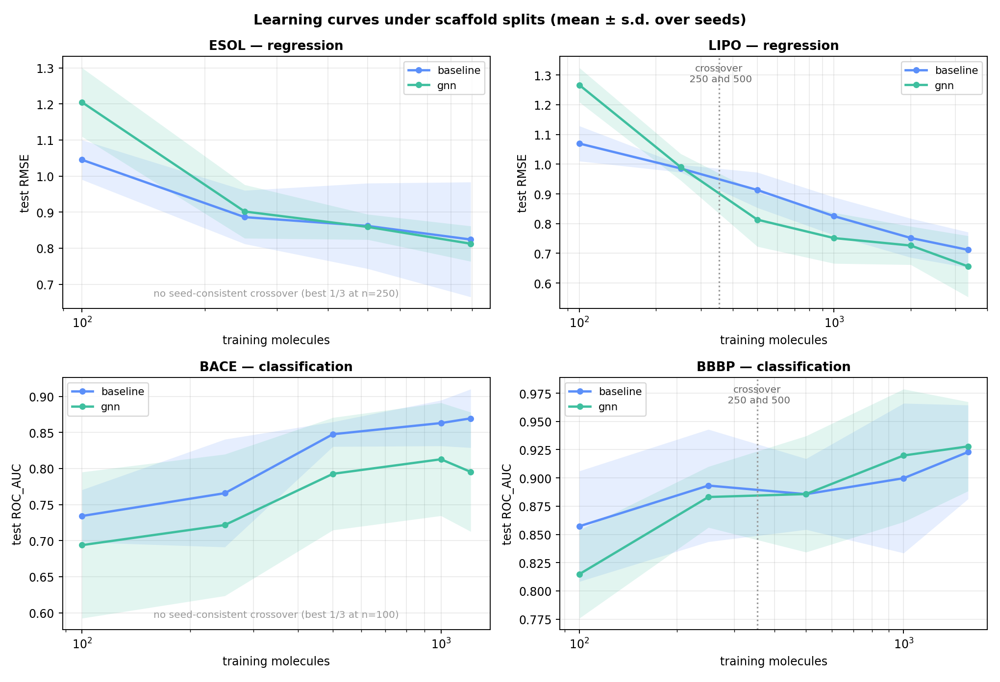
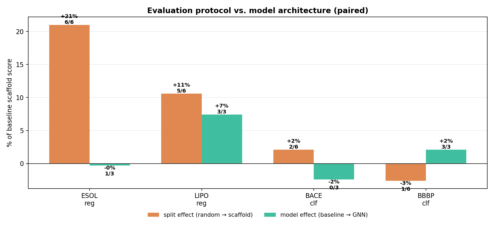
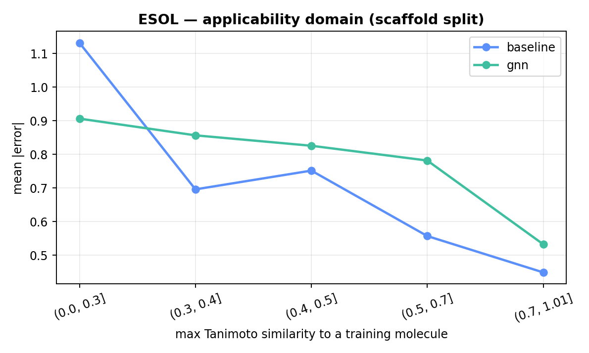
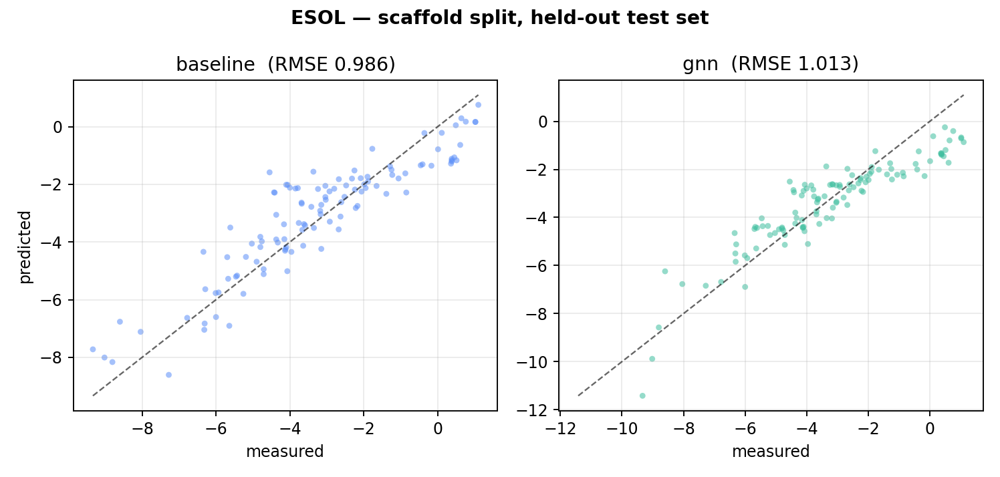
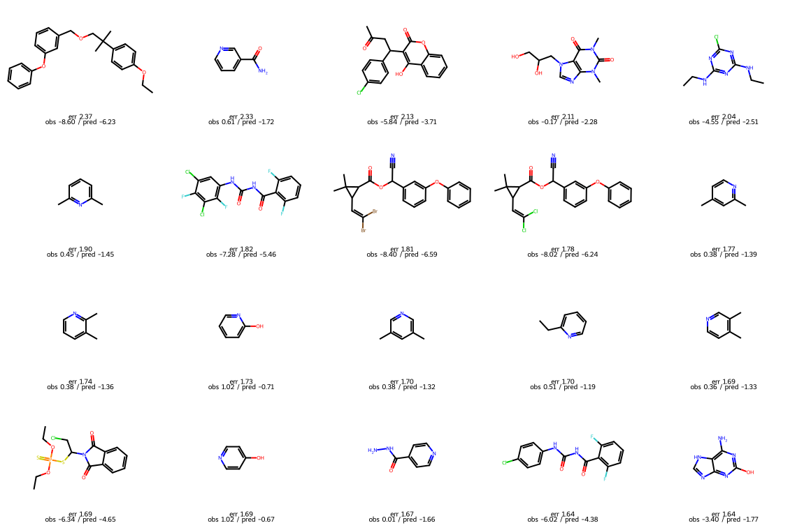

# When does a graph neural network actually beat molecular fingerprints?

**Across four MoleculeNet datasets, a GINE message-passing network beats a Morgan-fingerprint
LightGBM baseline on the most structurally novel test molecules every time such molecules
exist — by 0.15 to 0.23 in mean absolute error, on all three datasets with test compounds
below 0.3 Tanimoto similarity to training. It wins on aggregate in only two of the four. The
difference is test-set composition: BACE, the one dataset where the GNN never leads at any
training size, contains no test molecule below 0.4 similarity at all.**

Aggregate benchmark scores are therefore as much a property of how a dataset was assembled
as of the model being scored.

Both models, four datasets, random and Bemis–Murcko scaffold splits, learning curves from
100 molecules to full size, 3 seeds throughout. All comparisons are paired within seed.



## Takeaways

- **A seed-consistent crossover exists on 2 of 4 datasets**, both between 250 and 500
  training molecules (lipophilicity, BBBP). ESOL and BACE never cross.
- **Where the GNN wins, it wins by little**: +7.4% of the baseline score on lipophilicity,
  +2.1% on BBBP. Where it loses: −0.3% on ESOL, −2.4% on BACE.
- **The GNN's advantage is concentrated in novel chemistry.** In the 0.0–0.3 similarity bin
  it beats the baseline on all three datasets that have one. It converts that into an
  aggregate win only where it is also competitive in the similar bins.
- **BACE has no novel chemistry to test on.** Every test molecule is ≥0.4 similar to
  training, so the regime where the GNN helps is simply absent — and the GNN loses at every
  training size.
- **The split effect is not universal.** Scaffold splitting is much harder than random on
  both regression sets (ESOL +21%, 6/6 pairings; lipophilicity +10.6%, 5/6) and neither
  harder nor easier on both classification sets (BACE +2.1%, 2/6; BBBP −2.6%, 1/6).
- **Paired comparison is necessary.** A first version of `summarize.py` called a crossover
  wherever the mean difference changed sign, and reported one on ESOL where only 1 seed in 3
  favoured the GNN. See "Methods note" below.

---

## Split effect vs. model effect



Scaffold minus random, paired within (model, seed); and GNN minus baseline on the scaffold
split, paired within seed. Positive means the scaffold split is harder, or the GNN is better.

| dataset | metric | split effect | pairs scaffold harder | model effect | seeds GNN wins |
|---|---|---|---|---|---|
| ESOL | RMSE | **+0.171** (+21.0%) | **6/6** | −0.003 (−0.3%) | 1/3 |
| Lipophilicity | RMSE | +0.075 (+10.6%) | 5/6 | **+0.052** (+7.4%) | **3/3** |
| BACE | ROC-AUC | +0.019 (+2.1%) | 2/6 | −0.021 (−2.4%) | 0/3 |
| BBBP | ROC-AUC | −0.024 (−2.6%) | 1/6 | +0.019 (+2.1%) | **3/3** |

On ESOL the split effect is 57× the model effect and unanimous across pairings — the result
that motivated this repo. But it does not generalise. On both classification datasets the
split effect is within seed noise, and on BBBP the scaffold split is *easier* than random in
5 of 6 pairings.

One plausible reason, offered as interpretation rather than result: ROC-AUC is a ranking
metric and is insensitive to a uniform shift in predicted scores, whereas RMSE is not, so
covariate shift between train and test costs a regression model more than a classifier.
BBBP additionally has well-documented label noise and strong class imbalance, either of
which can swamp a small split effect.

## Learning curves

| dataset | crossover | advantage at full size | seeds |
|---|---|---|---|
| ESOL | none (best 1/3, at n=250) | +0.012 | 1/3 |
| Lipophilicity | **between 250 and 500** | +0.056 | 2/3 |
| BACE | none (best 1/3, at n=100) | −0.074 | 1/3 |
| BBBP | **between 250 and 500** | +0.005 | 2/3 |

Paired advantage by training size is in `results/paired_curve_all.csv`. On lipophilicity the
GNN wins on 3/3 seeds at n=500, 1,000 and 2,000. Below ~250 molecules the baseline wins
everywhere, on every dataset, by a wide margin (0.16–0.20 RMSE on the regression sets).

The advantage does not widen with more data. On lipophilicity it peaks at n=500 (+0.100) and
is smaller at full size (+0.056).

## Applicability domain

Mean absolute error binned by maximum Tanimoto similarity to any training molecule, scaffold
split. Positive `Δ` means the GNN is better.

| similarity bin | ESOL Δ (n) | Lipo Δ (n) | BACE Δ (n) | BBBP Δ (n) |
|---|---|---|---|---|
| 0.0 – 0.3 | **+0.225** (30) | **+0.224** (36) | — (0) | **+0.155** (20) |
| 0.3 – 0.4 | −0.161 (25) | +0.092 (70) | — (0) | +0.212 (37) |
| 0.4 – 0.5 | −0.074 (29) | +0.040 (61) | +0.229 (4) | +0.153 (40) |
| 0.5 – 0.7 | −0.225 (18) | +0.069 (132) | +0.072 (54) | +0.277 (81) |
| 0.7 – 1.0 | −0.084 (11) | +0.035 (121) | +0.021 (94) | +0.292 (20) |



This is the most consistent result in the project. Wherever a test set contains molecules
below 0.3 similarity to anything in training, the GNN predicts them better — on ESOL,
lipophilicity and BBBP alike, by a similar margin each time. A Morgan fingerprint is a
similarity-matching representation: it performs well when the test molecule resembles a
training molecule and degrades sharply when it does not. On ESOL the baseline's error is 2.5×
higher in the least-similar bin than the most; the GNN's is 1.7×.

Two consequences follow.

**BACE's test set has no molecules below 0.4 similarity.** It is a single-target inhibitor
series, so the region where the GNN helps does not occur, and BACE is exactly the dataset
where the GNN loses at every training size. The model comparison was decided by dataset
construction before either model was trained.

**A bin-level advantage need not become an aggregate one.** ESOL has the largest share of
novel test molecules of the four (49% below 0.4 similarity), and the GNN still wins only
that one bin — it is worse in the other four, which hold the remaining 51% of the test set.
Lipophilicity is the case where the GNN is better in every bin, and it is the dataset with
the clearest aggregate win.

BBBP is anomalous: the baseline's error *rises* with similarity to training (0.327 → 0.447),
the opposite of the expected direction. Consistent with the label-noise caveat above, and
not otherwise explained here.

## Error analysis (ESOL)



Predicted vs. measured on the scaffold-split test set, seed 0 only — these RMSE values are
one draw, not the 3-seed means above. Both models compress the range: points sit above the
diagonal at the insoluble end and below it at the soluble end.



Seventeen of the twenty worst predictions fall into two chemical families, failing in
opposite directions.

**Ten substituted pyridines, all predicted too insoluble.** Nicotinamide, four lutidines,
2-ethylpyridine, 2- and 4-hydroxypyridine, isoniazid. Measured 0.0 to +1.0, predicted −0.7
to −1.7: a systematic offset of 1.6–2.3 log units in one direction. Three further
N-heterocycles (guanine, a dimethylxanthine diol, a chlorotriazine) fail the same way.

**Seven large lipophilic agrochemicals, predicted too soluble.** logP 4.3–6.5, MW 340–505 —
two pyrethroid esters, two benzoylureas, a hydroxycoumarin, an organophosphate phthalimide,
a diaryl ether. Measured −6.0 to −8.6, predicted −4.4 to −6.6.

The pyridine cluster follows from the split. Bemis–Murcko groups monocyclic azines under one
scaffold, so the splitter moved the whole family into the test set at once. No pyridine
appears in training, and the model applies the shrinkage learned from carbocyclic aromatics
instead. Half the worst-case error comes from one missing scaffold group — which is also why
ESOL's seed variance (±0.15 RMSE) is the largest of the four datasets.

There is a representational limit under the second cluster. Aqueous solubility depends on
solid-state lattice energy as well as partitioning; the General Solubility Equation
approximates logS ≈ 0.5 − 0.01(MP − 25) − logP, and melting point is not a function of the
2D molecular graph. Part of this error is not addressable by architecture changes on 2D
inputs. Equivalent tables for lipophilicity are in `results/worst20_lipo.csv`.

## Methods note: pairing

Within a dataset both models see the same split, the same seed and the same training subset,
so differences are taken per pair before averaging. This matters more than it sounds.

The first version of `src/summarize.py` declared a crossover wherever the mean difference
changed sign. That reported a crossover on ESOL at n=500, where the paired mean is +0.003
and only 1 seed in 3 favours the GNN — an artefact of one large seed swing. The current
version requires the paired mean to favour the GNN *and* a majority of seeds to agree, and
for at least half the seeds to keep agreeing at every larger training size. Under that rule
ESOL has no crossover.

Both criteria are needed. A seed majority alone also fails: on lipophilicity at n=250, 2 of
3 seeds favour the GNN while the paired mean still favours the baseline, because the single
loss is larger than the two wins.

Paired standard deviations are roughly half the unpaired ones (e.g. lipophilicity model
effect: 0.053 paired vs. 0.06–0.10 for either model alone), which is why the shaded bands in
the learning-curve figure overstate the uncertainty in the comparison between the two lines.

## Limitations

- Four datasets, 3 seeds each. Several differences reported here are of the same order as
  their paired standard deviation and are described as unresolved where that is the case.
- The interpretations offered for the classification/regression split-effect difference and
  for BBBP's inverted applicability-domain curve are not tested here.
- No hyperparameter search for either model beyond defaults, and the GNN's optimal
  configuration probably differs between n=100 and n=3,360.
- Learning-curve subsets are drawn uniformly from the training pool, not by scaffold, so
  small subsets retain more chemotype diversity than an early-stage project would have.
- Scaffold split is a proxy for prospective evaluation; a chronological split is closer to
  how a real programme unfolds.
- 2D topology only. No conformers, no 3D, no quantum-derived descriptors.
- Assay error in the reference values is not modelled; BBBP labels in particular are known
  to be noisy.

## Reproduce

```bash
git clone https://github.com/tienmng/gnn-vs-fingerprints.git
cd gnn-vs-fingerprints
pip install -r requirements.txt

for ds in esol lipo bace bbbp; do
  python -m src.run_all        --dataset $ds --seeds 0 1 2
  python -m src.analyze        --dataset $ds
  python -m src.learning_curve --dataset $ds --seeds 0 1 2
done
python -m src.summarize
```

Datasets download to `data/` on first run. CPU-runnable. See `QUICKSTART.md` for Colab.

## Layout

```
src/data.py            SMILES -> PyG graphs; explicit atom/bond featuriser
src/splits.py          random + Bemis-Murcko scaffold splits, with a leakage report
src/baseline.py        Morgan(2048, r=2) + 16 RDKit descriptors -> LightGBM
src/model.py           GINE message-passing network with residual connections
src/train.py           training loop, early stopping, metrics
src/run_all.py         {model} x {split} x {seed} grid -> results/*.csv
src/analyze.py         figures, worst-prediction table, applicability domain
src/learning_curve.py  test error vs. training-set size, scaffold split
src/summarize.py       paired cross-dataset comparison
```

## Design notes

- 44 atom and 11 bond features, listed explicitly in `src/data.py`, rather than
  `MoleculeNet`'s 9 preset features.
- Target standardised with training statistics only.
- Sum pooling alongside mean and max, since solubility scales with molecular size.
- Early stopping on validation, evaluation on test once.
- Train/test scaffold overlap asserted to be 0 on every scaffold-split run.
- Learning-curve subsets are nested and the split is fixed per seed, so the comparison is
  paired at every point.

## License

MIT
