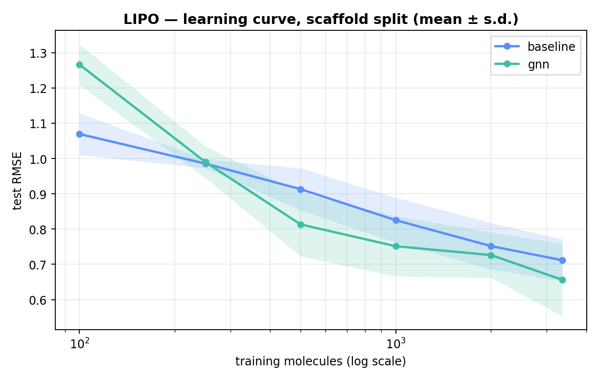
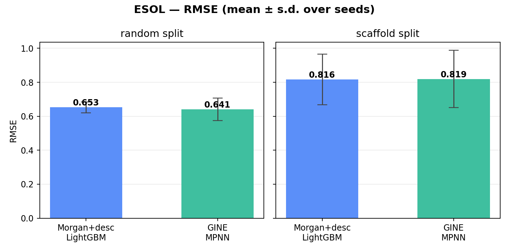

# When does a graph neural network actually beat molecular fingerprints?

**On lipophilicity, a GINE message-passing network overtakes a Morgan-fingerprint LightGBM
baseline between 250 and 500 training molecules and stays ahead by 0.03–0.10 RMSE. On
aqueous solubility it never overtakes it, at any training size up to the full dataset. The
deciding factor is the endpoint, not the data scale — and on ESOL, changing the split
protocol moves RMSE an order of magnitude more than changing the model.**

Both models evaluated under Bemis–Murcko scaffold splits, 3 seeds per configuration, on
MoleculeNet ESOL (n=1,117) and Lipophilicity (n=4,200).



## Takeaways

- **The crossover is at 250–500 molecules on lipophilicity.** Below it the fingerprint
  baseline wins on every seed; above it the GNN wins on every seed.
- **There is no crossover on solubility.** At n=893 the two models are level (0.819 vs
  0.816), and the GNN never pulls ahead. Data scale alone does not explain the difference
  between the two datasets.
- **The GNN advantage does not widen with more data.** After crossover it stays at
  0.03–0.10 RMSE rather than growing.
- **Protocol beats architecture on ESOL.** Random → scaffold split costs 0.163–0.178 RMSE;
  baseline → GNN changes it by 0.003–0.012.
- **Scaffold-split seed variance (±0.15) exceeds the model gap**, so single-seed comparisons
  on ESOL cannot resolve architecture differences.
- **Model ranking also depends on novelty.** On ESOL the GNN is better below 0.3 Tanimoto
  similarity to training and worse above it; the aggregate metric hides this.
- **Half the worst-case ESOL error is one scaffold family.** The splitter placed all
  monocyclic pyridines in the test set; ten of the twenty worst predictions are pyridines,
  all failing in the same direction.

---

## Learning curve (Lipophilicity)

Training set subsampled under a fixed scaffold split; validation and test sets held constant
per seed; subsets nested.

| n_train | baseline RMSE | GNN RMSE | GNN − baseline | seeds favouring GNN |
|---|---|---|---|---|
| 100 | 1.070 | 1.267 | +0.197 ± 0.026 | 0 / 3 |
| 250 | 0.986 | 0.990 | +0.005 ± 0.032 | 1 / 3 |
| 500 | 0.913 | 0.813 | −0.100 ± 0.047 | 3 / 3 |
| 1,000 | 0.825 | 0.751 | −0.074 ± 0.026 | 3 / 3 |
| 2,000 | 0.752 | 0.726 | −0.026 ± 0.018 | 3 / 3 |
| 3,360 | 0.712 | 0.656 | −0.056 ± 0.081 | 2 / 3 |

The paired difference is reported because both models see the same split and the same
training subset within a seed. Its standard deviation (0.02–0.08) is smaller than that of
either model alone (0.06–0.10), so the shaded bands in the figure overstate the uncertainty
in the comparison.

The sign flips between 250 and 500 molecules, and all three seeds agree at 500, 1,000 and
2,000. The gap does not grow monotonically afterwards.

### Why solubility behaves differently

At comparable training size the two datasets disagree: 1,000 lipophilicity molecules give
the GNN a 0.074 advantage, while 893 solubility molecules give it none. LogD is largely a
function of 2D topology and additive fragment contributions, which message passing can
learn. Aqueous solubility additionally depends on solid-state lattice energy — the General
Solubility Equation approximates logS ≈ 0.5 − 0.01(MP − 25) − logP, and melting point is not
a function of the molecular graph. On ESOL the extra capacity of the GNN has no accessible
signal to fit, which is consistent with the error analysis below.

---

## ESOL results

Aqueous solubility (log mol/L), 1,117 clean unique molecules, 80/10/10 split.

| model | split | RMSE (mean ± s.d., 3 seeds) |
|---|---|---|
| baseline (Morgan + descriptors → LightGBM) | random | 0.653 ± 0.032 |
| baseline | scaffold | 0.816 ± 0.148 |
| GINE MPNN | random | 0.641 ± 0.067 |
| GINE MPNN | scaffold | 0.819 ± 0.168 |

| effect | size |
|---|---|
| split protocol (random → scaffold), baseline | +0.163 RMSE (+25%) |
| split protocol (random → scaffold), GNN | +0.178 RMSE (+28%) |
| model choice (baseline → GNN), random split | −0.012 RMSE |
| model choice (baseline → GNN), scaffold split | +0.003 RMSE |



Test sets are not touched during training or model selection; early stopping uses the
validation split only. Train/test scaffold overlap is asserted to be 0 on every
scaffold-split run (`src/run_all.py`). The random split leaks 22 shared scaffolds into the
test set.

## Split protocol vs. model choice

A random split places close analogues of test molecules in the training set. Removing that
leak costs 0.163–0.178 RMSE, about a quarter of total error. The difference between
architectures is 0.003–0.012, smaller than the seed-to-seed standard deviation of either
model under either split.

Seed variance rises from 0.032 to 0.148 (baseline) and 0.067 to 0.168 (GNN) under scaffold
splitting, because there are only 269 scaffolds and which ones land in test matters. A
single-seed scaffold-split number on ESOL carries roughly ±0.15 RMSE of noise, more than ten
times the model difference it would be used to demonstrate. Three seeds gives a crude s.d.
estimate; treat it as an order of magnitude.

## Applicability domain

Mean absolute error against maximum Tanimoto similarity to any training molecule, ESOL
scaffold split.


| max Tanimoto to train | n | baseline MAE | GNN MAE |
|---|---|---|---|
| 0.0 – 0.3 | 30 | 1.132 | **0.906** |
| 0.3 – 0.4 | 25 | **0.696** | 0.857 |
| 0.4 – 0.5 | 29 | **0.752** | 0.826 |
| 0.5 – 0.7 | 18 | **0.557** | 0.782 |
| 0.7 – 1.0 | 11 | **0.449** | 0.532 |

The curves cross. The baseline degrades 2.5× from the most- to least-similar bin; the GNN
1.7×. The baseline is the better model above ~0.3 similarity and the worse model below it.

A Morgan fingerprint is a similarity-matching representation, so it performs well when the
test molecule resembles a training molecule and poorly when it does not. Averaged over the
full test set the two effects cancel, which is why the aggregate RMSE shows no difference.
The highest-similarity bin holds 11 molecules and is noisy; the 0.0–0.3 bin (n=30) is better
supported.

## Error analysis (ESOL)


Predicted vs. measured on the scaffold-split test set, seed 0 only — these RMSE values are
one draw, not the 3-seed means above. Both models compress the range: points sit above the
diagonal at the insoluble end and below it at the soluble end. The GNN extrapolates further
into the low tail, the baseline flattens against it.

The 20 worst test predictions, with descriptors in `results/worst20_esol.csv`.


Seventeen of the twenty fall into two chemical families, failing in opposite directions.

**Ten substituted pyridines, all predicted too insoluble.** Nicotinamide, four lutidines,
2-ethylpyridine, 2- and 4-hydroxypyridine, isoniazid. Measured 0.0 to +1.0, predicted −0.7
to −1.7: a systematic offset of 1.6–2.3 log units in one direction. Three further
N-heterocycles (guanine, a dimethylxanthine diol, a chlorotriazine) fail the same way.

**Seven large lipophilic agrochemicals, predicted too soluble.** logP 4.3–6.5, MW 340–505 —
two pyrethroid esters, two benzoylureas, a hydroxycoumarin, an organophosphate phthalimide,
a diaryl ether. Measured −6.0 to −8.6, predicted −4.4 to −6.6.

The pyridine cluster follows from the split. Bemis–Murcko groups monocyclic azines under one
scaffold, so the splitter moved the whole family into the test set. No pyridine appears in
training, and the model applies the shrinkage learned from carbocyclic aromatics instead.
Half the worst-case error comes from one missing scaffold group — which is also why the
aggregate RMSE varies so much between seeds.

## Practical reading

Below a few hundred training molecules, use fingerprints: the GNN is worse and far more
expensive. Above roughly 500, the GNN is worth training if the endpoint is a function of
molecular topology. If the endpoint depends on properties the graph does not encode — solid
state behaviour, conformational ensembles — extra model capacity buys little, and the
limiting factor is the representation rather than the architecture.

Independently of model choice, evaluate on a scaffold or chronological split and report
multiple seeds. On ESOL both effects are larger than the difference the model comparison is
trying to detect.

## Limitations

- Two datasets, one property class each. The endpoint-dependence explanation is an
  interpretation consistent with both, not a controlled test of it.
- 3 seeds gives a crude standard deviation estimate.
- The random vs. scaffold comparison was run on ESOL only; the learning curve was run on
  lipophilicity only.
- No hyperparameter search for either model beyond defaults, and the GNN's optimal
  configuration probably differs between the smallest and largest training sizes.
- Training subsets are drawn uniformly at random from the training pool, not by scaffold, so
  small subsets retain more chemotype diversity than a real early-stage project would.
- Scaffold split is a proxy for prospective evaluation; a chronological split is closer to
  how a real programme unfolds.
- 2D topology only. No conformers, no 3D, no quantum-derived descriptors.
- Assay error in the reference values is not modelled.

## Reproduce

```bash
git clone https://github.com/tienmng/gnn-vs-fingerprints.git
cd gnn-vs-fingerprints
pip install -r requirements.txt

python -m src.run_all --dataset esol --seeds 0 1 2
python -m src.analyze --dataset esol
python -m src.learning_curve --dataset lipo --seeds 0 1 2
```

Datasets download to `data/` on first run (`esol`, `lipo`, `bbbp`, `bace`). CPU-runnable.
See `QUICKSTART.md` for Colab.

## Layout

```
src/data.py            SMILES -> PyG graphs; explicit atom/bond featuriser
src/splits.py          random + Bemis-Murcko scaffold splits, with a leakage report
src/baseline.py        Morgan(2048, r=2) + 16 RDKit descriptors -> LightGBM
src/model.py           GINE message-passing network with residual connections
src/train.py           training loop, early stopping, metrics
src/run_all.py         {model} x {split} x {seed} grid -> results/*.csv
src/analyze.py         figures, worst-prediction table, applicability domain
src/learning_curve.py  test error vs. training-set size, scaffold split
src/summarize.py       cross-dataset comparison figures and table
```

## Design notes

- 44 atom and 11 bond features, listed explicitly in `src/data.py`, rather than
  `MoleculeNet`'s 9 preset features.
- Target standardised with training statistics only.
- Sum pooling alongside mean and max, since solubility scales with molecular size.
- Early stopping on validation, evaluation on test once.
- Learning-curve subsets are nested and the split is fixed per seed, so the comparison is
  paired.

## License

MIT
